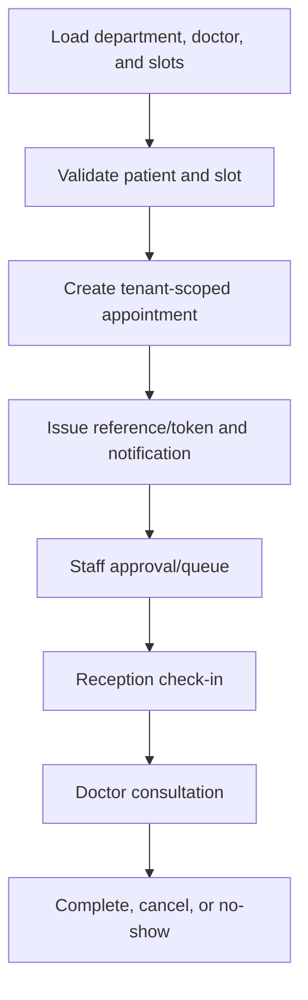

# Appointment Workflow

## Actors

Patient/public user, receptionist, doctor, admin, notification provider.

Active slot uniqueness is enforced by migration 029. Cancellation/no-show frees the slot. PHI lookup requires authentication while public schedule lookup returns minimal fields.

Open gates: live database race test, reschedule workflow verification, provider notification, every negative boundary, and full patient/reception/doctor E2E.
