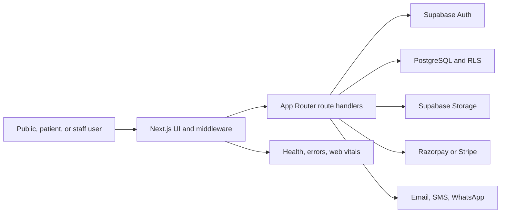

# Architecture

## System context

Sri Srinivasa Hospital HMS is a Next.js 14 App Router application. React client components provide public, patient, and staff interfaces. Route handlers form the HTTP API. Supabase Auth supplies identity; PostgreSQL with RLS supplies persistence and tenant isolation. External adapters cover Razorpay, Stripe, Gmail/Resend, WhatsApp Cloud API, and monitoring.

## Code boundaries

- `src/app`: pages, layouts, middleware entry point, and route handlers.
- `src/components`: public, admin, patient, role workspace, and shared UI.
- `src/lib`: domain services, validation, auth/RBAC, tenancy, providers, logging, and exports.
- `src/data`: development/static fallbacks.
- `supabase/migrations`: schema, constraints, indexes, triggers, and RLS.
- `tests`: unit, integration, and Playwright suites.
- `docs`: architecture, operations, phase evidence, and audit records.

## Request flow

1. Middleware resolves the hospital from the host and stamps an HTTP-only tenant cookie/header.
2. Public routes without an auth cookie skip the Supabase auth round trip.
3. Protected routes validate the Supabase user and read the canonical role.
4. RBAC maps the route to permitted roles.
5. Route handlers repeat authorization and validation for protected operations.
6. Services execute tenant-scoped Supabase queries or provider calls.
7. Audit/monitoring paths record security-sensitive and operational events.

## Current constraints

- Migrations 026–029 exist but their production application is not proven.
- Some services retain localStorage/in-memory development fallbacks.
- No explicit `server-only` boundary is present around secret-bearing service modules.
- Radiology, IPD/admission, discharge, wards/beds, insurance claims, payroll, and full inventory are not complete enterprise modules.

See [System Design](./System-Design.md), [Database Design](./Database-Design.md), and [Security Audit](./Security-Audit.md).
