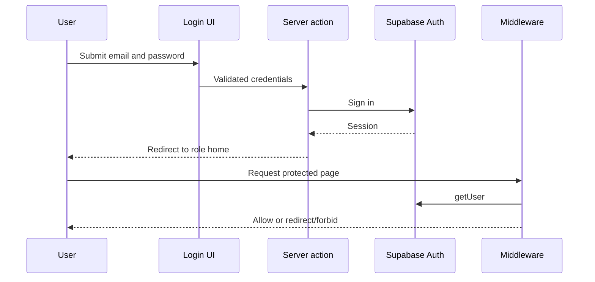

# Authentication

## Actors

Supabase users authenticate as super admin, admin, doctor, patient, receptionist, lab technician, pharmacist, billing, finance, HR, or manager.

## Login flow

## Controls

- Password policy and common-password rejection.
- Auth attempt rate limiting.
- Safe relative callback paths to prevent open redirects.
- Supabase `getUser()` for protected production routes.
- Role loaded from the profile and canonicalized.
- HTTP-only, SameSite tenant cookie.
- Logout and reset-password UI paths exist.

## Failure and retry

Invalid credentials return a generic failure. Missing/invalid sessions redirect to the appropriate login. Supabase retryable network failures currently appear in server logs and require network recovery.

## Production requirements

- Fail deployment if Supabase configuration is missing.
- Disable forgeable demo-cookie authentication in production.
- Verify token refresh, logout revocation, password reset, and every seeded credential against live Supabase.
- Record auth events without passwords, tokens, cookies, or sensitive request bodies.
