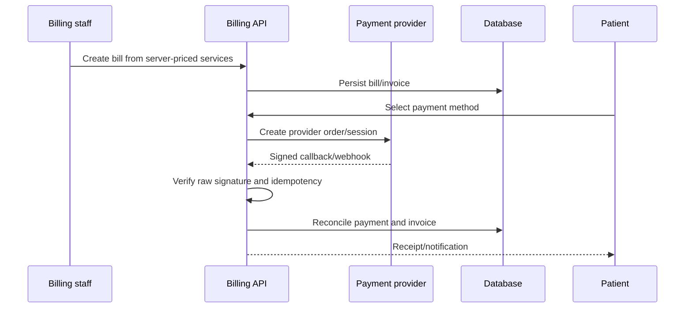

# Billing Workflow

Cash payment requires authorized staff. Online amounts must be derived server-side. Refunds require authorization, ownership/tenant checks, provider verification, and audit events. Mock completion must remain impossible in production.

Open gates: live Razorpay/Stripe sandbox flows, webhook replay, reconciliation, refund, invoice download, and role/RLS verification.
