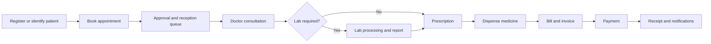

# Business Flows

## End-to-end patient journey

## Implemented flows

Hospital setup, auth/RBAC, tenant resolution, doctors, patients, appointments, walk-ins, prescriptions, laboratory, pharmacy, billing, invoices, payments/refunds, finance, HR, notifications, CMS, reports, analytics, settings, deployment, and monitoring have repository implementations of varying depth.

## Absent/incomplete flows

Radiology, IPD/admission, discharge, wards, bed allocation, emergency clinical operations, insurance claims, payroll, and full enterprise inventory are not complete. They must be specified with healthcare stakeholders before schema or UI work.

Detailed implemented flows are in the module workflow and role journey documents.
