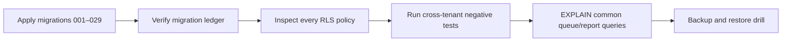

# Database Design

## Migration history

Migrations 001–029 cover the original schema, hospital management, CMS, appointments, doctors, packages, patient portal, billing/payments, notifications, role expansion, hardening, finance/HR, multi-hospital configuration, tenant RLS, admin scoping, null-tenant denial, and active-slot uniqueness.

## Principal domains

| Domain | Main data |
|---|---|
| Identity | Supabase users, profiles, roles, hospital membership |
| Hospital | Hospitals, branding/settings, module flags |
| Clinical | Doctors, departments, patients, appointments, prescriptions, lab orders |
| Pharmacy | Medicines, inventory/sales, dispense state |
| Billing | Bills, invoices, payments, refunds, provider events |
| Operations | Reception queue, availability, notifications, audit events |
| Business | Finance expenses/revenue, employees, attendance, leave |
| Content | Blog, gallery, testimonials, packages |

## Integrity

- Foreign keys connect clinical and financial records.
- `hospital_id` is the tenant boundary.
- RLS policies provide database-level isolation.
- Migration 029 adds an active appointment-slot uniqueness constraint and closes legacy null-tenant visibility.
- Application schemas enforce formats and state payloads before persistence.

## Required live audit

Production sign-off requires table-by-table generated documentation from the live schema, including exact columns, foreign keys, indexes, constraints, triggers, RLS policies, owning APIs/pages/roles, row counts, and query plans. Repository SQL alone cannot confirm live state.
