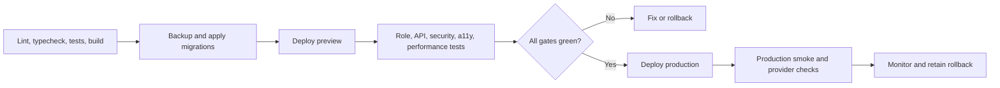

# Deployment

## Target

Vercel for Next.js; Supabase for Auth, PostgreSQL, and Storage.

## Safe sequence

Deployment is prohibited until migrations/RLS, all roles, Playwright, integrations, accessibility, performance, security, monitoring, backup, and rollback gates pass. No commit, push, or deployment was performed by this audit.
