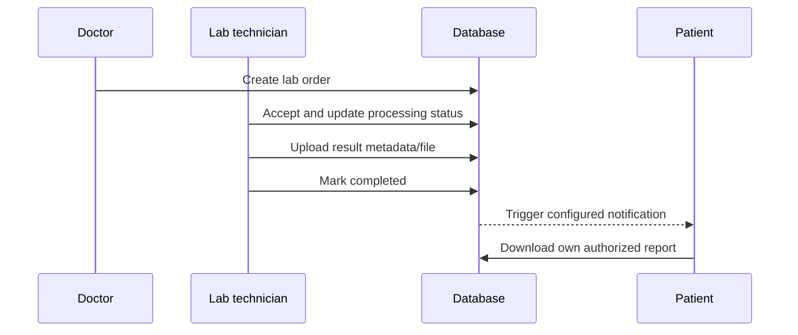

# Laboratory Workflow

## Purpose

Track a clinician-requested test from order through result delivery.

## Rules

- Only authorized clinical staff create orders.
- Lab technicians access their hospital's orders only.
- Status changes must follow the allowed state machine.
- Uploads require size/type/content validation, randomized storage paths, and ownership checks.
- Patients access only their own completed reports.
- Completion and notification attempts must be audited.

## Gaps

Live upload/download, PDF generation, malware/content inspection, notification delivery, RLS, and full status transition testing remain unverified.
