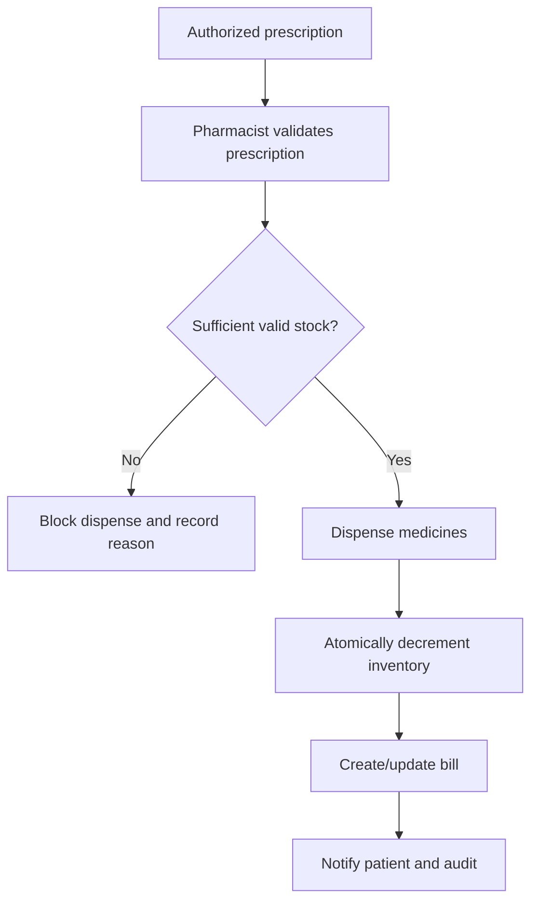

# Pharmacy Workflow

Required controls include tenant scope, prescription authenticity, expiry/batch checks, non-negative stock constraints, atomic inventory mutation, dispense idempotency, billing linkage, and audit logging.

Current code provides pharmacy UI/API and validation/demo services. Live concurrency, inventory reconciliation, role testing, and database transaction behavior are not verified.
