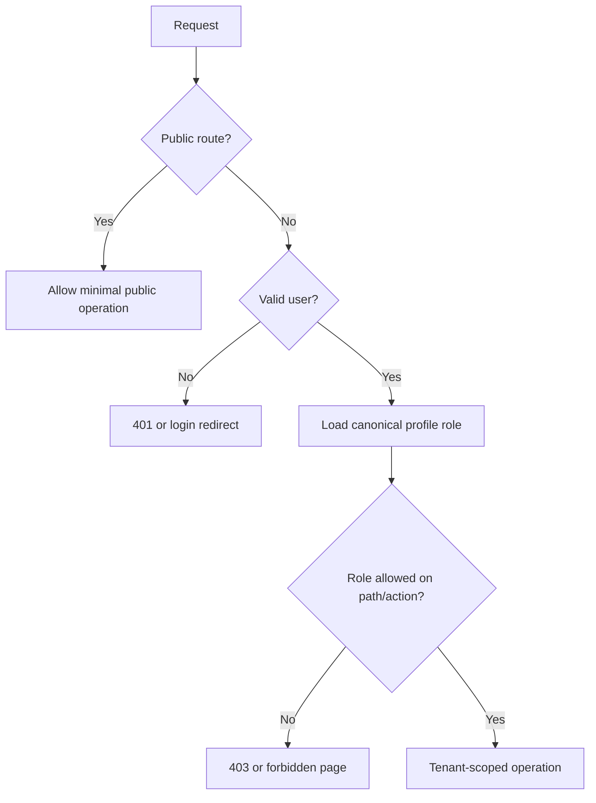

# Role-Based Access Control

The canonical matrix is implemented in `src/lib/auth/roles.ts`; middleware is not the sole authorization boundary.

| Role | Primary workspace | Intended access |
|---|---|---|
| super_admin | Admin | Platform and hospital administration |
| admin | Admin | Hospital settings, staff, clinical operations, CMS, reports |
| doctor | Appointments/clinical | Assigned appointments, patient history, prescriptions, lab orders |
| patient | Patient portal | Own profile, appointments, reports, prescriptions, payments |
| receptionist | Reception | Walk-ins, appointment queue, patient lookup |
| lab_technician | Laboratory | Lab orders, status, report upload |
| pharmacist | Pharmacy | Prescription queue, dispense, inventory |
| billing | Billing | Bills, invoices, payments |
| finance | Finance | Revenue, expenses, finance reports |
| hr | HR | Employees, attendance, leave |
| manager | Manager | Approved operational summaries |

## Enforcement flow

## Required validation

Credentialed positive and negative tests must prove every role can access allowed modules and cannot access every restricted UI route and API. Database RLS must independently deny cross-role/cross-tenant access.
