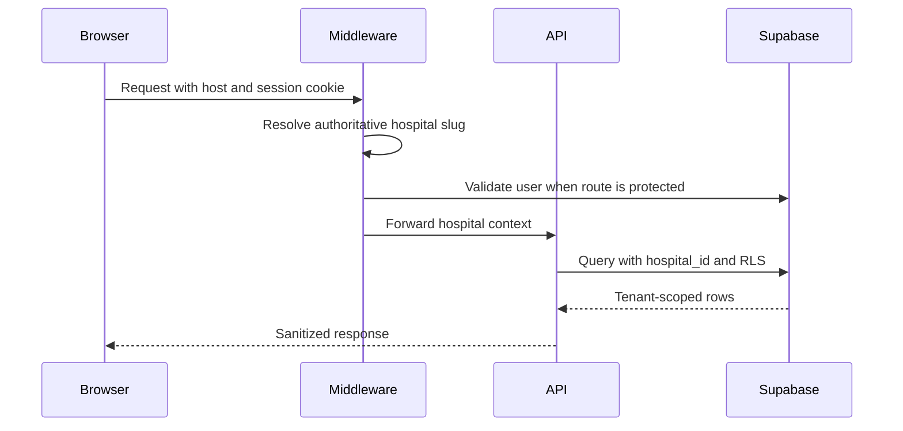

# System Design

## Design principles

- Preserve App Router and domain-service separation.
- Enforce authorization in middleware and again at API/service boundaries.
- Resolve tenant from trusted host configuration before client hints.
- Validate writes with Zod and database constraints.
- Fail closed for production payments and authentication configuration.
- Use RLS as defense in depth; never rely on UI hiding.

## Logical layers

| Layer | Responsibility |
|---|---|
| Presentation | Responsive public, patient, and role-specific React UI |
| Edge/middleware | Tenant resolution, session refresh, route RBAC |
| API | Authentication, authorization, validation, status codes |
| Domain | Appointments, patients, doctors, payments, notifications, HMS operations |
| Persistence | Supabase clients, PostgreSQL constraints/indexes/RLS, Storage |
| Integration | Payments, email, WhatsApp, monitoring |

## Multi-tenant model

## State and consistency

- Appointment state supports booking, approval, check-in, completion, cancellation, and no-show behavior.
- A partial unique index in migration 029 prevents duplicate active slots.
- Payment signatures are verified server-side; mock completion is disabled in production.
- Notification delivery records attempts and provider outcome.
- Financial, HR, lab, pharmacy, and billing state transitions require live integration validation.

## Missing designs

No complete schema/workflow was found for radiology, IPD/admission, ward/bed allocation, discharge, insurance claims, payroll, or enterprise backup/restore. These require approved product and clinical requirements before implementation.
